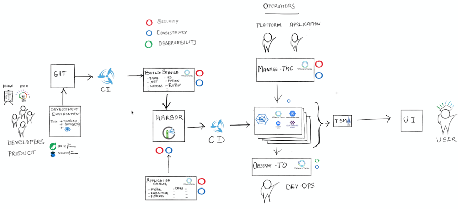

# End to End Tanzu Demo

## Overview

This repo provides an end to end Tanzu experience showcasing developer and platform operator perspectives.  The end state enables a demo flow that starts with an update to the Spring Pet Clinic spring boot application and ends with the updated application in production.  Along the way, the CI process compiles, tests, and packages the application, then triggers then triggers the Tanzu Build Service to containerize the app and push it to Harbor.  Harbor scans the image for vulnerabilities.  The CD process identifies a new image, publishes a deploy event to Tanzu Observability, and then apply's updated configuration for the app in Tanzu Kubernetes Grid.  The demo also highlights the devops experience provisioning the mysql database used by Spring Pet Clinic using Kubeapps and the Tanzu Application Catalog, as well as monitoring the app specific Tanzu Observability dashboard with the deploy events visible on the charts.  Finally we showcase the platform operator experience setting up daily backups for the Spring Pet Clinic workspace in Tanzu Mission Control and then accessing Kubernetes Cluster Dashboards in Tanzu Observability.

Big shoutout to my peers who created this demo, which was was the foundation of this [https://github.com/Pivotal-Field-Engineering/tanzu-gitops](https://github.com/Pivotal-Field-Engineering/tanzu-gitops)

## How to Get Everything Setup

0. [Setup Foundational Lab Environment and Bonus Labs](docs/00-tkg-lab-foundation.md)
1. [Setup Environment Specific Params Yaml](docs/01-environment-confg.md)
2. [Install TBS And OOTB Dependencies](docs/02-tbs-base-install.md)
3. [Setup TBS Demo Stack and Cluster Builder](docs/03-tbs-custom-dependencies.md)
4. [Setup Workspace and Pet Clinic Namespace](docs/04-petclinic-workspace.md)
5. [Setup Spring Pet Clinic TBS Project Namespace](docs/05-petclinic-tbs-namespace.md)
6. [Deploy Spring Pet Clinic MySql Database](docs/06-petclinic-db.md)
7. [Setup spring-petclinic code and config repositories](docs/07-petclinic-repos.md)
8. [Create Concourse Pipeline for Spring Pet Clinic](docs/08-petclinic-pipeline.md)
9. [Create TO Wavefront Dashboard](docs/09-petclinic-dashboard.md)
10. [Update TBS Stack to Remediate CVEs](docs/10-tbs-stack-update.md)

## Execute the Demo

With the above in place, you are now set to deliver an awesome short demo showcasing Tanzu!

[Execute the Demo](docs/demo.md)

## Key Capabilities Explained

1. Custom Events in Tanzu Observability
2. Concourse / Tanzu Build Service Integration
3. TBS Rebase Resolves Vulnerabilities

## One-off Activities

[Execute the Demo](docs/one-off.md)