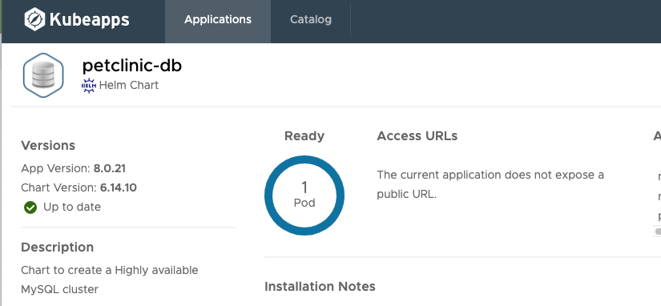

# Deploy Spring Pet Clinic MySql Database

1. Access Kubeapps on Workload Cluster

2. Switch the context to the namespace "petclinic"

3. Click Catalog and Search for MySql and then click MySql

4. Deploy MySql and name it `petclinic-db`

Use values

```yaml
db:
  name: petclinic
  password: petclinic
  user: petclinic
replication:
  enabled: false
root:
  password: petclinic
```

5. Wait for App to be ready




## Go to Next Step

[Setup Spring Pet Clinic code and config repositories](07-petclinic-repos.md)