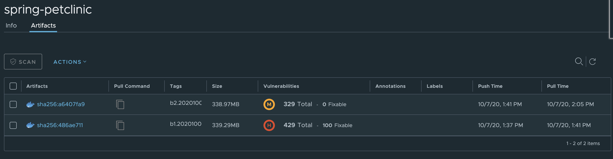

# Update TBS Stack to Remediate CVEs 

1. Set environment variables for use in the following sections

```bash
export TBS_REPOSITORY=$(yq r $PARAMS_YAML tbs.harborRepository)
```

2. Trigger a new build of Spring Pet Clinic by updating the Stack associated with its builder

>Note: Ensure you have switched your local kube context to your shared services cluster

```bash
# This sets the stack to use the patched images from TBS dependencies v100.0.46.  You can check this in the descriptor-100.0.46.yaml that you downloaded in step 2.
kp clusterstack update demo-stack \
  --build-image $TBS_REPOSITORY/build@sha256:f61360cf0751a0e1706ae95ceb96a0a084e6e39c0b2754970eb5f2ef9f3e6d8c \
  --run-image $TBS_REPOSITORY/run@sha256:5330d81fb5bc38558404899f7324915d4f1ebdcb5a29f1c6b45a2638a941212d
```

3. Validate the Harbor has been updated

```bash
kp build list spring-petclinic
```

Harbor should now show a second image created with fewer CVEs.



## Go to Next Step

[Setup Load Generation for More Interesting Dashboards](11-load-generation.md)